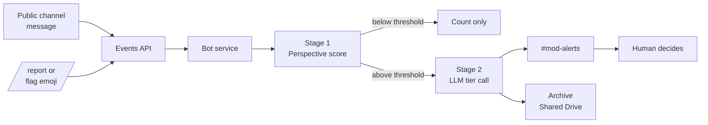

# HESA Slack Moderation Bot — Build Spec

2026-09-17 · @Someone

A custom Slack app that flags possible harassment in public channels for human review, takes reports, and preserves evidence outside Slack's 90-day window. Implements the automated parts of the HESA Slack Moderation Policy.

## 1. Architecture

One small stateless service. Slack sends it events, it scores them, and it writes to two places: a private moderator channel and an archive outside Slack. It never writes back to public channels.



**Components**

| Component | Role |
| --- | --- |
| Slack app | Receives events, posts alerts, renders the report modal |
| Bot service | Verifies, filters, scores, routes. Stateless per request |
| Stage 1 classifier | Cheap score on every message, discards the \~99% that are ordinary |
| Stage 2 classifier | LLM call on survivors only, returns a policy tier and reasoning |
| Archive writer | Appends flagged content and log rows to the Google Shared Drive |
| `#mod-alerts` | Private channel, moderators only, where humans triage |

**Design constraints that shape everything below**

1. Nothing is deleted or edited by automation. The bot's output is always a notification to a human.
2. The bot is the only durable record. Slack hides messages at 90 days and deletes at one year, so the archive write happens at flag time, not later.
3. It must run for roughly the cost of a couple of coffees a month, and must survive a change of Director of Technology.

**Scale assumption.** HESA's WhatsApp community is roughly 2,000 members. Slack membership will be smaller after attrition, but plan for 500–2,000 members and on the order of 1,000–5,000 public messages a day at peak periods such as registration and finals.

At that size:

- **Stage 1 volume** is the binding technical constraint. Perspective API's default quota is modest (on the order of one query per second) and an increase must be requested. Queue Stage 1 calls and rate-limit outbound rather than firing per event.
- **Stage 2 cost** stays small. At 5,000 messages a day with 2% reaching Stage 2, that is roughly 100 LLM calls a day, still in the range of a few dollars a month.
- **Moderator capacity is the real ceiling.** Three to five student moderators covering 2,000 members is a ratio that fails under load. Thresholds must be set conservatively enough that alerts stay reviewable, which means accepting that the classifier will miss things and leaning harder on `/report`.
- **Slack's 90-day window bites much harder.** At this volume the workspace loses a large amount of context every quarter, which makes the archive in Section 7 load-bearing rather than a nicety.

If Slack membership lands under 300, revert to lighter assumptions and relax the queuing.

### Observed problem profile

The conduct actually observed in HESA's existing WhatsApp community is not harassment. It is two distinct patterns, neither of which the harassment classifier is the right instrument for.

| Observed | What it actually is | Primary mechanism |
| --- | --- | --- |
| Heavy personal disclosure in a general channel | Context mismatch, and distress among bystanders who did not expect it. Not misconduct | Channel structure and a warm human response. No classifier, no sanction, ever |
| Unsolicited promotion, or the same message posted across several channels | Low-grade nuisance | Deterministic cross-post detection and a clear posted rule |
| Group response to that spam | The actual community-standards violation in the sequence | Pile-on detection, promoted to a primary detector |

**The person who triggers an incident is often not the person who breaches the standards.** In the dogpiling pattern, the spammer is a nuisance and the crowd is the violation. A system tuned to flag the original message will consistently identify the wrong party. Section 5's aggravating factors and the pile-on rule in Section 4 matter more here than any per-message score.

**Cross-post detection needs no AI.** Normalize message text, hash it, and check for the same content appearing in more than two channels within an hour. This is a few lines of code, produces almost no false positives, and addresses the trigger for most of the observed friction. Build it before anything in Section 4.

**Distress disclosures are not a moderation problem.** Automation's role here is limited to quietly notifying moderators, never to responding publicly, never to removing the message, and never to producing a record of the student who posted it. The real fixes are structural: a channel where that conversation is welcome, a pinned list of support resources, and moderators who know how to respond kindly and where to point someone. Confirm with the Dean of Students office what counseling and support services HES students can actually access, since Extension students' access differs from that of other Harvard schools, and get that list right before publishing it.

**The harassment classifier still earns a place**, but lower in the build order than Section 10 currently implies. A migration that brings 2,000 people into a new space changes the population and its norms, and HES administration has asked for harassment coverage specifically. Build it; just do not let it displace the two mechanisms above, which address what is actually happening.

## 2. Slack app configuration

Build a **non-workflow custom app**, not a Workflow Builder automation. Workflow Builder is a paid feature on Pro and above, but custom apps using the Events API and Web API work on the Free plan. Create it at api.slack.com/apps, scoped to the HESA workspace only, and do not list it in the Slack Marketplace.

**Bot token scopes**

| Scope | Why |
| --- | --- |
| `channels:history` | Read messages in public channels. The core requirement |
| `channels:read` | Resolve channel names for alert context |
| `users:read` | Resolve user IDs to display names in alerts |
| `chat:write` | Post alerts into `#mod-alerts` |
| `commands` | Register `/report` |
| `reactions:read` | Detect the flag emoji on a message |
| `groups:history` | **Only** if moderators decide to cover specific private channels, with those channels told. Omit by default |

Do not request `im:history`, `mpim:history`, or any user token. The policy says DMs are not monitored; the app should be technically incapable of reading them, so that the claim is verifiable by anyone who inspects the app's scopes.

**Event subscriptions**

- `message.channels` — every public-channel message
- `reaction_added` — the flag emoji path

Those are the only two subscriptions. Note that `message_changed` and `message_deleted` are not separate subscriptions: they arrive as subtypes on `message.channels`, so the app receives them regardless. **For v1, drop every event carrying a `subtype` at the top of the handler**, alongside bot messages and channel joins. Handling edits and deletions can be added later if evasion by editing turns out to be a real pattern; it is not worth the complexity before there is evidence of it.

**Interactivity**

- Request URL for the `/report` modal and for the action buttons on alert messages
- One slash command: `/report`

**Free-plan app budget.** The Free plan allows 10 installed apps workspace-wide. This bot consumes one slot. Audit what is already installed before building, because hitting the ceiling mid-project forces an awkward choice between moderation and whatever a previous board installed and forgot.

**Channel membership.** The bot must be invited to every public channel it should cover. It will not receive events for channels it is not in. Add a checklist item to the channel-creation runbook, or the coverage will silently rot as new channels appear.

## 3. Hosting and runtime

**The hard requirement:** Slack retries any event request not acknowledged with HTTP 200 within 3 seconds, and retries up to three times. An LLM call takes longer than that. So the handler acknowledges immediately and does the work after.

```
POST /slack/events
  1. verify signature            (< 1 ms)
  2. handle url_verification     (setup only)
  3. drop bot messages, joins,
     channel_join subtypes       (< 1 ms)
  4. return 200 OK               <-- within 3 s, always
  5. process asynchronously      (Stage 1, maybe Stage 2, writes)
```

Idempotency matters because retries still happen on timeout: key on `event_id` and discard duplicates, or moderators will see the same alert three times.

**Platform options**

| Option | Fit | Notes |
| --- | --- | --- |
| Cloudflare Workers | **Selected** | Free tier of 100K requests/day and 10ms CPU per invocation, far above this workload. CPU excludes time awaiting Slack and the classifier. No cold starts, no billing account, no card. Use `waitUntil()` for post-ack work and KV for the dedupe key |
| Google Cloud Run | Good alternative | Always Free covers 2M requests/month. Plain containers and portable. Needs a GCP billing account, which is a Treasurer decision, and is separate from the Harvard-owned Workspace |
| Render | Not suitable on free | Free services spin down after 15 minutes idle with a 30–60 second cold start, which breaks Slack's 3-second acknowledgment and drops events. The paid tier starts around $7/month |
| Fly.io | No longer free | Free allowances ended in 2024; new accounts get a short trial and then require a card. Roughly $3–8/month for a small always-on machine |
| AWS Lambda | Workable | Fine technically; the most operational overhead per unit of value here |

Pick whichever the current Director of Technology can hand over. The deciding factor is not performance, it is whether next year's officer can redeploy it.

**Stack.** Slack's Bolt framework assumes a Node server and does not run cleanly on Workers. On Cloudflare the app is a small handler instead: Hono or itty-router for routing, and HMAC-SHA256 signature verification through the WebCrypto API, which is around thirty lines and is the one piece of protocol worth writing by hand. Everything else is plain `fetch` calls against Slack's Web API. Use Bolt only if the platform choice changes to Cloud Run or another Node host.

**Secrets.** Signing secret, bot token, classifier API keys, and the Google service-account credential live in the platform's secret store, never in the repo. Rotate at every leadership transition, since an outgoing officer's access should end with their term.

**Repository.** A HESA-owned GitHub organization, not a personal account. This is the single most common way student-org infrastructure is lost.

## 4. Classification pipeline

Two stages, because running an LLM on every message is both wasteful and slow, while running only a score-based classifier produces alerts nobody trusts.

### Stage 1 — cheap filter

Google Jigsaw's **Perspective API** returns per-message probabilities for attributes including toxicity, severe toxicity, insult, threat, and identity attack. It is free for non-commercial use at modest request rates. Request only the attributes that map to the policy.

Pass to Stage 2 if any of: `SEVERE_TOXICITY` > 0.5, `THREAT` > 0.5, `IDENTITY_ATTACK` > 0.6, or `TOXICITY` > 0.75. Otherwise increment a counter and stop. Store no message content for messages that stop here.

These numbers are starting points, not findings. Tune them in shadow mode (Section 10).

### Stage 2 — tier assignment

An LLM call that receives the flagged message plus context and returns a policy tier with reasoning. Context is what makes this worth doing: a single message is often unreadable without the five that preceded it, and the difference between Tier 0 and Tier 2 is usually a pattern rather than a word.

**Input:** the flagged message, the preceding 10 messages in that channel or thread, the channel name, whether the author and target have appeared together in prior flags, and the text of Sections 2 and 5 of the moderation policy.

**Output:** strict JSON, no prose, no markdown fences.

```json
{
  "tier": 0,
  "categories": ["bullying"],
  "targeted_at_member": true,
  "confidence": "medium",
  "reasoning": "One sentence a moderator can read in three seconds.",
  "context_note": "Anything that might make this a false positive."
}
```

**Prompt principles**

- Give it the policy text verbatim and ask it to cite the section it is applying. A tier without a section reference is not actionable.
- Instruct it explicitly to return Tier 0 for criticism of HESA, criticism of HES, blunt disagreement, quoted or reported speech, and reclaimed language used self-referentially. These are the false positives that will otherwise erode moderator trust in the first month.
- Require the `context_note` field to be filled whenever confidence is not high. A moderator reading "this may be sarcasm between friends" acts differently than one reading a bare score.
- Never ask the model to recommend an action. It assigns a tier; Section 6 of the policy decides what happens.

**Model choice.** Any current mid-tier model handles this well. At a few hundred messages a day with maybe 1–3% reaching Stage 2, expect single-digit dollars per month. Keep the model name in configuration, not in code.

**Suicidal ideation and self-harm.** Add this as a separate detection path, not a harassment tier. It is not a moderation matter and must never produce a sanction. Route it to moderators with the crisis-resource language agreed with the Dean of Students office, and treat it as Tier 3 referral only in the sense that a human contacts the School promptly.

### Pattern detection

Single-message scoring misses the most common form of harassment, which is repetition. Maintain a rolling 7-day count in the archive of flags by author and by target. Escalate to a moderator alert regardless of tier when one author accumulates 3 or more Stage 2 flags, or when 3 or more authors flag against the same target within 24 hours, which is the signature of a pile-on.

## 5. Report intake

This is the half of the system that covers what the classifier cannot see. Build it first, not last.

### `/report`

Opens a modal. Slack requires the `views.open` call within 3 seconds of the command, so acknowledge, then open.

| Field | Type | Required |
| --- | --- | --- |
| What happened | Multiline text | Yes |
| Where | Channel select, plus a "direct message" option | Yes |
| When | Plain text, approximate is fine | No |
| Who was involved | Plain text, not a user picker | No |
| File as | Radio: named, or anonymous | Yes |
| Screenshot | File upload | No |

Use a plain text field rather than a user picker for the accused. A picker turns naming someone into a two-click action and makes the form feel like an accusation machine.

**Anonymity is real or it is not offered.** If the reporter selects anonymous, the alert posted to `#mod-alerts` must not contain their user ID, and the archived record must not contain it either. Do not keep a hidden mapping "just in case" — if it exists, someone will eventually be asked for it. Tell anonymous reporters in the confirmation message that moderators cannot follow up with them and that this limits what can be done.

**Confirmation.** An ephemeral message on submit: received, what happens next, expected acknowledgment within 48 hours per the policy.

### Flag emoji

A designated emoji (`:flag-for-review:`, created in workspace settings so it cannot be confused with an ordinary reaction) triggers a `reaction_added` event. The handler pulls the message, its permalink, and surrounding context, and posts it to `#mod-alerts` marked as member-reported. The reporter's identity goes to moderators but is never surfaced in-channel. The reaction itself is visible to everyone in the channel, so document that: a member choosing this route is flagging visibly, and should use `/report` if they want privacy.

### Deduplication

Several members flagging the same message produces one alert thread with a count, not five alerts. A message already flagged by Stage 2 and then member-reported updates the existing alert rather than creating a second.

## 6. Moderator alerts

Alerts land in `#mod-alerts`, a private channel whose membership is the Moderation Team and the HESA President. A Block Kit message with three parts.

**1. What was flagged.** The message text, author, channel, timestamp, and a Slack permalink. Include the preceding three messages as context, visually distinguished from the flagged one. A moderator should be able to decide without leaving the channel in most cases.

**2. Why it was flagged.** Suggested tier, categories, the model's one-sentence reasoning, and the `context_note`. Label it plainly as a suggestion. Wording such as "Suggested: Tier 2 — moderator decides" does real work in keeping people from treating the output as a verdict.

**3. Buttons.**

| Button | Effect |
| --- | --- |
| Dismiss | Logs a dismissal with the moderator's ID. No further action |
| Take Tier 0/1 | Assigns to the clicking moderator, opens a note field, logs it |
| Escalate to Tier 2 | Posts in-thread requesting a second moderator; unlocks only when a second person confirms |
| Escalate to Tier 3 | Pings the Moderation Team lead and the President, starts the referral packet |
| Recuse | Records that this moderator is conflicted and hides the alert from them |

The two-moderator requirement in the policy is enforced here, in the interaction handler, not left to memory. A Tier 2 action that has not been confirmed by a second moderator simply does not complete.

**Triage state** lives in the alert's thread: assigned, dismissed, escalated, closed. Slack's 90-day window means the thread is a working surface, not the record. Every state change also writes to the archive.

**Anonymous reports** appear with the reporter field omitted entirely rather than showing a redaction. Redaction marks invite someone to ask what is behind them.

**Alert volume.** If moderators receive more than a handful of alerts a week, thresholds are wrong. Chronic over-alerting produces reflexive dismissal, which is worse than no system: it creates a record showing HESA saw the conduct and did nothing.

### Reducing moderator load

The scarce resource is moderator attention, not compute. Each of the following removes work without moving a sanction decision away from a human.

**Auto-dismiss high-confidence Tier 0.** The largest single win. If Stage 2 returns Tier 0 with high confidence, log it and never surface it. Moderators see only what might need them. Review the auto-dismissed set monthly rather than case by case.

**Digest instead of ping.** Tier 0 and Tier 1 flags accumulate into one daily digest posted each morning. Only Tier 2 and Tier 3 interrupt anyone. A moderator opening one message a day is sustainable; a moderator receiving fifteen notifications is not.

**On-call rotation.** One moderator owns triage each day, on a published rota. Everyone else ignores `#mod-alerts` unless escalated to. Five moderators reading everything is five times the work and produces diffusion of responsibility, not five times the coverage.

**Draft the response.** For Tier 1, the bot pre-writes the warning DM citing the policy section breached, and the moderator edits or sends with one click. This converts a ten-minute task, most of which is deciding how to word it, into about fifteen seconds. The moderator still approves before anything sends.

**Assemble the referral packet.** On Tier 3, the bot gathers the evidence file, permalinks, context, and interim measures into a formatted document ready to send to the Dean of Students office. The hardest moments should require the least clerical work.

**Cluster pile-ons.** Multiple flags against one target within 24 hours become a single alert with all participants listed, not one alert per message. One decision instead of six.

**Zero manual recordkeeping.** Every button click writes the log row. Moderators never open a spreadsheet. Any process requiring a volunteer to remember to record something will not survive the semester.

**Automated nudge, before a human is involved.** For messages scoring high on Stage 1 but assessed as Tier 0 or 1, the bot may send the author an ephemeral message visible only to them: a neutral note that the message may read as hostile and a link to the community standards. No record, no sanction, no moderator involvement. This deflects a meaningful share of friction before it becomes a case. Keep it rare and keep it non-punitive; a bot that lectures people about ordinary disagreement will be resented, and rightly.

**Prevention beats triage.** A code-of-conduct acknowledgment gate at join, clear channel purposes, and threads-by-default all reduce incident volume more cheaply than any classifier. At 2,000 arriving members these are worth more attention than threshold tuning.

### What stays human

The sanction decision. The bot never warns, suspends, or removes on its own authority, however confident the classifier is.

This is not caution for its own sake. An automated suspension of a student who was quoting harassment to report it, or using reclaimed language, or arguing forcefully with HESA leadership, is precisely the incident that ends the program and damages HESA's standing with the School. The human step is what makes every other piece of automation here safe to run.

## 7. Archive and incident log

The archive exists because Slack's free plan hides messages at 90 days and deletes data after a year. The write happens at flag time. There is no later.

**Where.** A restricted folder in the HESA Google Shared Drive. Harvard owns the drive, which keeps the record inside University infrastructure and means it survives a lapsed HESA subscription to anything.

**How the bot authenticates.** A Google Cloud service account, added to the Shared Drive as a Content Manager. HES permits external content managers, which is what makes this work: the service account is outside the harvard.edu domain, and Harvard does not need to provision anything.

Two constraints worth knowing. A Google Group cannot hold credentials or authorize an application, so the HESA shared inbox cannot be the writing identity; it is a mailing address, not an account. And service accounts have no Drive storage quota of their own, so a Shared Drive is not merely preferable, it is the only place this can write. Files it creates count against Harvard's storage rather than HESA's.

**Project ownership.** The service account lives in a Google Cloud project, and that project needs owners who are people. Create it under a HESA-controlled account, then immediately grant a second officer the Owner role in IAM, and add each incoming Director of Technology at handover. A project with one owner is the same single-person dependency this document keeps warning about, relocated.

**The key.** Authentication uses a service-account JSON key stored as a secret in the hosting platform. It is a long-lived credential: treat it as one, keep a break-glass copy in the team vault, and rotate it at every transition. Grant the service account access to the archive folder only, never to the Shared Drive as a whole.

**Two artifacts per incident.**

*Evidence file* — a JSON document per incident:

```json
{
  "incident_id": "2026-0042",
  "captured_at": "2026-09-17T14:22:03Z",
  "source": "stage2 | report | emoji",
  "channel": "community",
  "permalink": "https://...",
  "flagged_message": { "user_id": "U…", "ts": "…", "text": "…" },
  "context": [ { "user_id": "U…", "ts": "…", "text": "…" } ],
  "classifier": { "stage1_scores": {}, "suggested_tier": 2, "reasoning": "…" },
  "subsequent_edits": [],
  "subsequent_deletion": null
}
```

Capture Slack user IDs, not display names. Display names change; IDs do not.

*Log row* — appended to a Google Sheet in the same folder, matching the policy's incident log fields exactly:

| Column | Source |
| --- | --- |
| Incident ID | Generated, sequential per year |
| Date opened | Bot |
| Source | Bot |
| Tier assigned | Moderator action, not the classifier |
| Suggested tier | Classifier, kept alongside for calibration |
| Moderators involved | Button clicks, including recusals |
| Action taken | Moderator action, or dismissal with reason |
| Referred to HES | Moderator, with date and office |
| Date closed | Moderator |

Keeping suggested tier beside assigned tier is what lets the annual review answer whether the classifier is calibrated. Without both columns the question is unanswerable.

**Dismissed flags are written too**, with a minimal record: ID, date, channel, suggested tier, dismissing moderator, reason. Not the message text. A dismissal log with content in it becomes a file of things students said that HESA decided were fine, which is a liability with no offsetting benefit.

**Retention.** A scheduled job deletes evidence files three years after their incident closes. Retention that depends on someone remembering to delete things is not retention.

## 8. Limits and failure modes

**What the bot cannot see**

- Direct messages and group DMs, by design and by scope
- Private channels it has not been added to
- Huddle audio, and voice or video content
- Text inside uploaded images and screenshots, unless OCR is added later
- Any channel it was never invited to

Harassment moves to DMs almost immediately once a member realizes public channels are monitored. Treat the classifier as covering the loud, visible cases and the `/report` path as covering the serious ones.

**Evasion.** Character substitution, spacing, images of text, coded language, and in-jokes all defeat scoring. The LLM stage handles some of this. Do not try to win this arms race; the pattern detection in Section 4 and human reports are the durable answers.

**Failure behavior**

| Failure | Behavior |
| --- | --- |
| Classifier API down or rate-limited | Queue and retry with backoff. Post a notice in `#mod-alerts` after 15 minutes. Never drop silently |
| LLM returns malformed JSON | Retry once, then alert with Stage 1 scores only and a flag that Stage 2 failed |
| Archive write fails | Alert immediately and loudly. This is the one failure that destroys evidence. Retry with backoff and hold in memory or a local queue until it succeeds |
| Slack rate limits | `chat.postMessage` is roughly one per second per channel. At realistic alert volumes this never binds |
| Bot removed from a channel | Detect via `member_left_channel` and notify moderators. Silent coverage loss is the failure most likely to go unnoticed |

**The dependency risk.** Perspective API terms, LLM pricing, and free hosting tiers all change. Keep the classifier behind an interface so swapping providers is a configuration change. Record in the repo README what each dependency is and what happens if it disappears.

**The real failure mode** is not technical. It is a bot that runs for a year with nobody reading `#mod-alerts` because the moderators who set it up graduated. Section 10's quarterly review exists to catch that.

## 9. Security and data minimization

**Request verification.** Validate the `X-Slack-Signature` header against the signing secret on every request, and reject timestamps older than five minutes. Without this, anyone who learns the endpoint URL can inject fabricated messages into the moderation record.

**Minimize what leaves Slack.** Only messages passing Stage 1 have their text sent to an external classifier. Messages below threshold are counted and discarded. Send the message and its context, never the whole channel.

**Minimize what is stored.** Store content only for flagged incidents. Dismissed flags keep metadata only. There is no general message archive, and the bot must not become one by accident.

**Access.**

- `#mod-alerts` membership equals the Moderation Team plus the President, audited at every leadership transition
- The Drive folder uses the same list; Google's audit log shows who opened what
- Hosting platform and Slack app admin access belong to the Director of Technology and one designated backup officer
- Every credential rotates at handover

**Vendor terms.** Confirm before launch that the chosen classifier provider does not train on submitted content, and that its data-retention terms are acceptable for content about identifiable students. Record the answer in the repo. This is a question HES administration may reasonably ask.

**FERPA.** Slack messages between students are not education records, so FERPA is unlikely to apply directly. But this system holds identifiable records about students' conduct, stored in Harvard-owned infrastructure, created by a recognized student organization. Ask the Dean of Students office whether they want the archive treated under any University records policy before going live, rather than after an incident.

**Transparency as a control.** The repository should be readable by any HESA member on request, and the disclosure in the policy should match what the code actually does. The strongest defense against "HESA is surveilling students" is that the scopes are narrow, published, and verifiable.

### Secrets management

HESA has no secrets infrastructure. Credentials have historically lived in a Google Sheet. This system introduces at least six new secrets, so the storage question has to be settled before the first deploy rather than after.

**Two categories, two homes.**

| Category | Examples | Where it lives |
| --- | --- | --- |
| Runtime secrets | Slack signing secret, bot token, classifier API keys, Google service-account key | The hosting platform's secret store. Injected as environment variables, never in the repo |
| Shared human credentials | Slack workspace admin, CampusPress, social accounts, the classifier vendor's billing login | A team password manager vault |

Runtime secrets do not belong in the password manager for operational use. Keep one break-glass copy of each in the vault so a successor can recover the system, and treat the platform's store as the source of truth.

**Password manager selection.** Ask HES IT first whether Harvard already licenses one that student organizations can use. Failing that, the two realistic options are 1Password's flat-rate small-team pack, which is roughly $240 a year for up to ten people, and Bitwarden Teams at about $4 per user per month. Both have nonprofit and education programs worth applying to. Cost is secondary to two other criteria:

1. **Ownership.** The organization account must be registered to the HESA shared inbox, never to a student address. An officer who graduates should not hold the root of HESA's credential store.
2. **Admin recovery.** Confirm before purchase that an administrator can recover vault items belonging to a departed member without that member's cooperation. Officers graduate and stop answering email. This capability varies by tier and is the feature that will actually be needed.

**Service accounts over personal accounts.** Wherever a platform allows it, the bot authenticates as a service identity owned by the organization rather than as a person. The Google service account writing to the Shared Drive is the model. Anything authenticating as a named student breaks on graduation.

**Rotation.** Every runtime secret rotates at each leadership transition, and immediately on any unplanned departure. The Slack signing secret and bot token are regenerated from the app config; classifier keys are reissued from their consoles.

**Migrating off the spreadsheet.** Credentials in the existing sheet cannot be moved into a vault as-is. Google Sheets retain revision history, and the file has plausibly been shared with, exported by, or visible to every officer for several years. Treat every credential in it as compromised: rotate each one, enter the new value directly into the vault, then delete the sheet and purge it from Trash. Deleting first and rotating later leaves the exposure and loses the inventory.

## 10. Build phases

**Anchor the schedule to the influx, not the calendar.** A forced migration delivers a large group at once, and a community's norms are set in its first few weeks. Phase 1 must be live before people start arriving, so that the first member who needs to report something finds a working path rather than a promise. If the shutdown date and this schedule conflict, ship Phase 1 early and let the classifier phases slip.

**Phase 1 — Reporting only (week 1–2).** `/report`, the flag emoji, `#mod-alerts`, and the archive writer. No classifier. This alone satisfies most of what HES administration is asking for, and it is the part that catches the serious cases. Ship it and announce it.

**Phase 2 — Shadow mode (week 3–6).** Stage 1 and Stage 2 run, but alerts go to a separate channel visible only to the Director of Technology and one moderator. Nobody acts on them. Purpose is calibration:

- How many messages per day pass Stage 1?
- Of those reaching Stage 2, what fraction would a moderator have considered actionable?
- Which false positives recur, and can a prompt instruction eliminate that class?
- Does suggested tier match what a human would have assigned?

Do not skip this. Thresholds tuned on intuition rather than on the workspace's actual traffic are the main reason moderation bots get muted.

**Phase 3 — Go live (week 7).** Classifier alerts move to `#mod-alerts`. Post the Section 3 disclosure as a channel bookmark before the first alert, not after. Announce in the community channel in plain language: what is monitored, what is not, who sees it, how to report.

**Phase 4 — Steady state.** Quarterly, alongside the policy's anonymized board report, check: alert volume, dismissal rate, suggested-versus-assigned tier agreement, and whether anyone is actually reading `#mod-alerts`.

**Success criteria**

| Measure | Target |
| --- | --- |
| Dismissal rate of classifier alerts | Under 50%. Above that, thresholds are wrong |
| Alerts per week | Whatever the Moderation Team can actually review. At 2,000 members, budget roughly 10–15 minutes of triage per moderator per day and set thresholds to fit that, not the other way round |
| Median time to first moderator response | Within the policy's tier timelines |
| Reports via `/report` | Non-zero. Zero reports means members do not trust the channel, not that nothing is happening |
| Moderator-to-member ratio | Revisit the team size if it exceeds roughly 1 moderator per 300 active members |

That last row is the one to watch. A silent `/report` in a community where students are quietly leaving is the failure this whole system is meant to prevent.

## 11. Open decisions

Settle these before writing code. Each one changes the build.

- [ ] **Who builds and maintains it.** If the answer is only the current Director of Technology, the design should be simpler than this one. A single-officer dependency is the largest risk in the spec
- [ ] **Hosting platform**, weighted toward handover rather than performance. If GCP, the Treasurer needs to approve a billing account
- [ ] **Classifier providers**, plus confirmation of their training and retention terms
- [ ] **Private channel coverage.** Default is none. If moderators want any, which ones, and members of those channels must be told
- [ ] **Screenshot handling.** Reports will include images of DMs. Where do those live, and for how long?
- [ ] **Sheet versus database** for the incident log. A Sheet is readable by non-technical officers and lives in the Shared Drive; a database is tidier and less likely to outlive its author
- [ ] **Slack app slot.** Audit current installs against the 10-app free-plan limit
- [ ] **Dean of Students review** of the archive and records approach before go-live

**Sequencing note.** Phase 1 depends on none of the classifier decisions. If the board wants something in place quickly, build reporting and archiving now and settle the rest during shadow mode.
