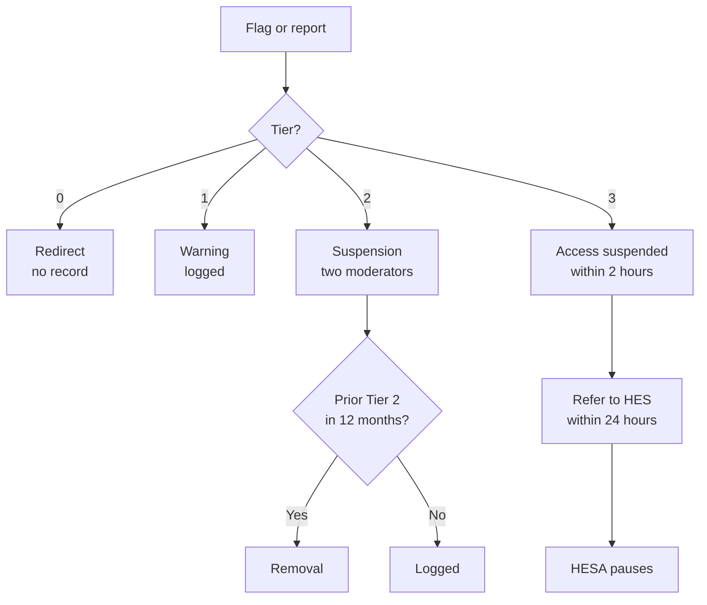

# HESA Slack Moderation Policy & Escalation Matrix

2026-09-17 · @Someone

## 1. Purpose and scope

This policy governs conduct in the HESA Slack workspace and sets out how reports are handled, who decides, and when a matter leaves HESA's hands.

**Who it covers.** Actively enrolled HES students who are members of the workspace: admitted degree-seeking students and course takers. HESA does not serve alumni; alumni matters belong to the Harvard Extension Alumni Association.

**Where it applies.** All channels in the HESA Slack workspace, and direct messages between members that arise from participation in it. Conduct elsewhere is outside HESA's remit unless it targets a member because of their participation in HESA spaces.

**Relationship to Harvard policy.** This is a community standard for a student-run space. It does not replace or override the HES Student Handbook or University policy on discrimination and sexual and gender-based harassment. Any member may report directly to the School or the University at any time, with or without involving HESA.

**What this policy is not.** HESA is a student government, not an investigative or disciplinary body. Moderators are students, not trained investigators. The only remedies available under this policy affect access to and participation in the HESA Slack workspace. HESA does not determine whether University policy has been violated and does not impose academic consequences.

## 2. Community standards

Members are expected to treat one another as colleagues in a shared academic community. The following conduct is prohibited.

**Harassment.** Unwelcome conduct directed at a person that is severe or persistent enough to interfere with their participation. Includes repeated unwanted contact after being asked to stop, sexual advances or comments, threats, and intimidation.

**Discrimination and identity-based attacks.** Slurs, demeaning generalizations, or hostility directed at a person or group based on race, color, national origin, ethnicity, religion, sex, gender identity or expression, sexual orientation, age, disability, veteran status, or immigration status.

**Bullying.** Conduct meant to humiliate, isolate, or intimidate a member. Includes public ridicule, coordinated pile-ons, and persistent hostile replies to one person.

**Doxxing and privacy violations.** Posting another member's personal information, or screenshots of private conversations, without consent.

**Retaliation.** Any adverse action against a person for filing a report, being named in one, or participating in a review. Retaliation is treated at the same severity as the underlying conduct or higher.

**Impersonation and misrepresentation.** Posing as another student, as a HESA officer, or as HES or Harvard staff.

### Conduct that is disruptive but not prohibited

Some behavior harms the community without meeting the definitions above: derailing threads, unsolicited commercial posting, repeatedly ignoring channel purpose, or escalating a disagreement into personal remarks. These receive correction rather than sanction (Tier 0 and Tier 1 in Section 6).

### What is not a violation

Disagreement, criticism of HESA or its officers, criticism of HES policy or instruction, and blunt speech are not violations. Discomfort alone does not make conduct prohibited. Moderators should be slow to act on a single sharp message and quick to act on a pattern aimed at one person.

## 3. Monitoring and transparency

HESA discloses its monitoring rather than conducting it quietly. Undisclosed monitoring of a student community is itself a trust problem.

**What is monitored.** Messages in public channels pass through an automated classifier that scores them for harassment, threats, and identity-based attacks. Messages scoring above a threshold are posted to a private moderator channel for human review. No message is deleted, edited, or acted on by automation alone.

**What is not monitored.** Direct messages and private channels are not visible to HESA under the workspace's current Slack plan. HESA cannot read them, search them, or recover them. Members should understand that a DM is private from HESA and that harassment occurring there will only be addressed if someone reports it.

**Who sees flagged content.** Only members of the Moderation Team (Section 8). Flags are not shared with the wider board, with HES staff, or with the person who was flagged, except as part of a response under Section 6.

**What members are told.** The disclosure below is posted as a channel bookmark in the community channel and shown during onboarding. Joining the workspace constitutes acknowledgment.

> Public channels in this workspace are reviewed by an automated tool that flags possible harassment for human moderators. Direct messages are not monitored. Flagged messages are read by the HESA Moderation Team only. Reports can be filed with `/report`.

**Limits of automation.** The classifier produces false positives, particularly on reclaimed language, quoted speech, sarcasm, and discussion about harassment. A flag is a prompt for a human to look, never a finding. Moderators may not act on a flag without reading the surrounding conversation.

## 4. How to report

Any member may report conduct, whether or not it was directed at them. Bystander reports are welcome and are handled the same way.

| Route | How | Anonymity |
| --- | --- | --- |
| `/report` in Slack | Opens a form: what happened, where, optional screenshot | Named or anonymous, reporter's choice |
| Message emoji | React with the reporting emoji to flag a message to moderators | Reporter's identity visible to moderators only |
| Direct to a moderator | DM any Moderation Team member | Named |
| Direct to HES | Bypass HESA entirely; see Section 7 | Per the School's process |

**Anonymous reports** are accepted and reviewed. They constrain what HESA can do: without a reporter to clarify context, a moderator can act on what is visible in the workspace but cannot substantiate claims about private conduct. Anonymous reports are never dismissed for being anonymous.

**Acknowledgment.** Every named report receives an acknowledgment within 48 hours stating that it was received and what happens next. The reporter is told the outcome in general terms. Sanctions imposed on another member are not disclosed in detail.

**Reports about moderators or officers** go to the HESA President and the Director of Technology jointly, and the subject of the report is recused under Section 8. If a report names both, it goes directly to the HES Dean of Students office.

**No wrong door.** A member who reports to the wrong person, or to HES first, has still reported. HESA does not require exhaustion of its internal process before a student goes to the School.

## 5. Severity tiers

Every incident is assigned one of four tiers. The tier drives the response in Section 6. When a moderator is between two tiers, the higher tier applies and a second moderator reviews.

**Tier 0 — Friction.** Rudeness, thread derailment, off-topic or promotional posting, a single sharp exchange between people who are arguing about a topic rather than attacking each other. Examples: dismissive replies in a debate about course selection; repeated job postings in the community channel.

**Tier 1 — Violation.** A clear breach of Section 2 that is isolated, not aimed at a protected characteristic, and not threatening. Examples: an insult directed at a named member; posting a screenshot of someone's DM without consent; a hostile reply that ends a conversation.

**Tier 2 — Serious violation.** Conduct that is targeted and either persistent or identity-based. Examples: a slur; repeated unwanted contact after being asked to stop; a coordinated pile-on; sexual comments about a member; sustained hostility toward one person across several days.

**Tier 3 — Critical.** Conduct implicating safety or University policy, regardless of whether it is a first occurrence. Examples: threats of violence; sexual harassment or unwanted sexual advances; stalking behavior; doxxing that exposes a home address or workplace; content suggesting a member is at risk of harming themselves or others.

**Aggravating factors** that raise the tier by one: retaliation against a reporter, the subject holds a HESA office, the target is a new member, or the same member has a prior finding at any tier within 12 months.

**Mitigating factors** that may lower the tier by one, except from Tier 3: prompt unprompted apology, the conduct was a misfired joke in a thread where the target says they were not harmed, or the member self-reports.

## 6. Escalation matrix

| Tier | Response | Decided by | Timeline | Refer to HES? |
| --- | --- | --- | --- | --- |
| 0 — Friction | Public redirect in thread, or a quiet DM. No record beyond the flag log. | Any moderator, acting alone | Same day | No |
| 1 — Violation | Message removed if still visible. Written warning by DM citing the section breached. Logged. | Any moderator, alone; second moderator notified | 48 hours | No |
| 2 — Serious violation | Message removed. Posting suspended 7–30 days. Written finding to the member. Reporter told an outcome was reached. Logged. | Two moderators concurring | 5 business days | Optional; required if identity-based |
| 3 — Critical | Immediate suspension of access pending review. Referral filed with HES. HESA takes no further action until the School responds. | Moderation Team lead plus HESA President | Access suspended within 2 hours; referral within 24 hours | **Required** |
| Repeat Tier 2 within 12 months | Removal from the workspace | Two moderators plus HESA President | 5 business days | Yes, notify |

**Interim measures.** At any tier, a moderator may separate the parties immediately without a finding: muting a thread, asking both to step back, or suspending access for up to 24 hours pending review at Tier 3. Interim measures are not sanctions and are not recorded as findings.

**Removal is the ceiling.** The most HESA can do is remove a student from a Slack workspace. It cannot affect enrollment, grades, or standing. Any consequence beyond workspace access is the School's decision, not HESA's.

**Notice before sanction.** At Tier 1 and above, the member is told what conduct was found, which section it breached, and how to appeal. At Tier 2 and above they are given an opportunity to respond before the sanction is finalized, except where interim measures apply.

Every path ends in the incident log (Section 9), including Tier 0 flags that were dismissed.

## 7. Mandatory referral to HES

HESA refers rather than adjudicates in the following categories. In each, the Moderation Team's role ends at securing the workspace and filing the referral. Moderators do not interview witnesses, do not attempt to determine what happened, and do not decide whether policy was violated.

- Sexual harassment, unwanted sexual advances, or sexual misconduct
- Threats of violence or conduct suggesting risk to anyone's safety
- Stalking, or persistent contact that continues after workspace access is removed
- Discrimination or harassment based on a protected characteristic
- Any indication that a member may harm themselves
- Any conduct a moderator believes may violate the HES Student Handbook

**Offices to refer to.** The referral goes to the HES Dean of Students office as the primary contact. Matters involving sex- or gender-based harassment are also within the remit of the University's Office for Gender Equity, which handles Title IX matters. Safety emergencies go to Harvard University Police, or 911, before anything else.

> **Open item for the Executive Board.** Named contacts and current intake addresses for these offices must be confirmed with HES administration and recorded here before this policy takes effect. Do not publish the policy with placeholders.

**What a referral contains.** The incident log entry, the preserved messages with timestamps and Slack permalinks, the reporter's account if they consent to being named, and a statement of what interim measures HESA has taken. Nothing more. Moderators do not offer conclusions.

**After referral.** HESA takes no further action on the substance. Interim measures stay in place until the School advises otherwise. If the School asks HESA to reverse a suspension, HESA complies and records that it did so at the School's direction.

**Confidentiality.** Referred matters are discussed only among the moderators handling them and the HESA President. Moderators do not post about incidents in HESA channels, do not discuss them with other board members, and do not confirm to anyone that a report exists.

## 8. Moderation Team

**Composition.** A minimum of five moderators, appointed by the Executive Board for one-year terms, scaling toward one moderator per 300 active members. At least one must be an Executive Board member; at least two should not be, so the team is not purely officers reviewing their own community. The Director of Technology maintains the tooling but is not automatically a moderator.

If the team cannot be staffed to that ratio, the Executive Board records which channels are actively moderated and which are not, and says so publicly. Partial coverage stated plainly is defensible. A promise of coverage the team cannot meet is not.

**Authority limits.** A moderator acting alone may take Tier 0 and Tier 1 actions and interim measures. Tier 2 and above require a second moderator. No moderator may act alone on a matter involving a member they have a personal or working relationship with.

**Recusal is mandatory** where the moderator is the reporter, the subject, a participant in the exchange, a candidate in an election the subject is involved in, or a close associate of either party. A recused moderator does not view the flag, the log entry, or the discussion. If recusals leave fewer than two eligible moderators for a Tier 2 matter, the matter goes to the HESA President; if the President is also conflicted, it is referred to HES.

**Training.** Before taking a moderator seat, each appointee reads this policy in full, reviews the previous term's anonymized incident log, and completes any bystander intervention or harassment-response training HES makes available to student leaders. Confirm availability with the Dean of Students office.

**Turnover.** HESA's leadership changes annually and its moderators will change with it. Continuity lives in the incident log and this document, not in individuals. Outgoing moderators brief incoming ones and lose access to the moderator channel and the archive on the day their term ends.

**Accountability.** Moderator actions are summarized in an anonymized quarterly report to the Executive Board: number of flags, number dismissed, actions taken by tier, referrals made. No names, no message content.

## 9. Documentation and retention

**The retention problem.** On Slack's free plan, messages and files older than 90 days are hidden from view and search, and data older than one year is deleted from Slack's servers. A complaint that surfaces in month five will have no evidence left in Slack. Any moderation process that relies on Slack as its own record will fail at exactly the moment it matters.

**The archive.** Flagged messages and their surrounding context are written to a restricted folder in the HESA Google Shared Drive at the time of flagging. That drive is Harvard-owned, which keeps the record inside University infrastructure rather than a tool HESA rents. Access is limited to current moderators and the HESA President.

**Incident log.** One row per incident, regardless of outcome:

| Field | Notes |
| --- | --- |
| Incident ID | Sequential, no names |
| Date opened |  |
| Source | Flag, `/report`, emoji, direct |
| Tier assigned | 0–3 |
| Moderators involved | Including any recusals |
| Action taken | Or dismissed, with reason |
| Referred to HES | Date and office |
| Date closed |  |

Dismissed flags are logged too. A log that only records actions cannot show whether the classifier is over-flagging or whether one group is disproportionately flagged.

**Retention period.** Incident records are kept for three years from closure, then deleted. Records referred to HES are kept until the School confirms the matter is closed, then follow the same schedule.

**Access.** Moderators lose access when their term ends. The Director of Technology maintains the folder's permissions and audits them at each leadership transition. Archived content is not used for any purpose other than moderation and the anonymized reporting in Section 8.

## 10. Appeals

Any member subject to a Tier 1 sanction or above may appeal once.

1. **Filing.** Within 14 days of being notified, by email to the HESA President. The appeal states what the member believes was wrong: the finding, the tier, or the sanction.
2. **Who hears it.** The HESA President plus one Executive Board member who had no role in the original decision. No moderator who decided the matter participates.
3. **Standard.** The appeal asks whether the finding was supported by what was in the workspace and whether the tier was applied as written. It is not a rehearing.
4. **Outcome.** Upheld, tier reduced, or overturned. Decided within 10 business days and recorded in the incident log.
5. **Effect on sanctions.** A suspension continues during an appeal. A removal is stayed unless the conduct was Tier 3.

**Not appealable within HESA:** matters referred to HES under Section 7. Those follow the School's own process, and HESA has no authority to revisit them.

**Reporters may not appeal** an outcome they consider too lenient, but may report the matter to HES independently at any time.

## 11. Review and amendment

**Annual review** by the Executive Board at the start of each term, informed by the year's incident log. The review asks three questions: were tiers applied consistently, is the classifier flagging the wrong things, and did any incident fall outside the categories in Section 5.

**Amendment** requires a majority vote of the Executive Board. Changes take effect 14 days after being posted in the community channel, so members are not sanctioned under rules they have not seen.

**Adoption.** This policy takes effect once the Executive Board adopts it and the referral contacts in Section 7 are filled in.

### Before this can be adopted

- [ ] Confirm HES Dean of Students intake contact and the Office for Gender Equity reporting route
- [ ] Share the draft with HES administration for comment before adoption
- [ ] Appoint the initial Moderation Team and confirm at least one non-officer member
- [ ] Build `/report` and the flagging bot; confirm the Shared Drive archive folder and permissions
- [ ] Post the Section 3 disclosure as a channel bookmark and add it to onboarding
- [ ] Board vote to adopt

### Version history

| Version | Date | Change |
| --- | --- | --- |
| 0.1 | 2026-09-17 | Initial draft for Executive Board review |
